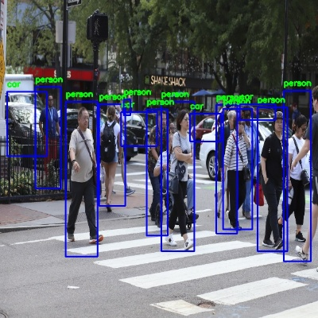

# driving-object-detector
DOD is a deep object detection algorithm implemented using Keras/Tensorflow, developed based on Joseph Redmon's 
Darknet-"You only look once V2" and optimized to perform detections specific to vehicle self driving applications.





The images above are taken randomly from the Google search results for "car on road" and "pedestrians" and are not found
in training or validation data sets.

#### Current object classes that can be detected:<br />
'person',<br />
 'bicycle', 'skateboard',<br />
 'car', 'truck', 'motorcycle', 'bus', 'train',<br />
 'traffic light', 'stop sign', 'parking meter',<br />
 'sports ball',<br />
 'animal'<br />


#### Credit where credit is due:

[Joseph Redmon](https://pjreddie.com/): approach to training a neural network for object detection - this project uses 
the feature extraction section of his model converted to Keras.
- [Original YOLO publication](https://arxiv.org/pdf/1506.02640.pdf) - main inspiration for this project
- [YOLO V3 - Latest publication in object detection](https://pjreddie.com/media/files/papers/YOLOv3.pdf) - not used here
but very cool

[Guillaume Ramé](https://github.com/guigzzz): developing the loss calculation approach compatible with Keras models. 
How list predictions are converted to y_train vectors for training is largely a product of his work.
- [Professional profile](https://uk.linkedin.com/in/guillaume-rame)
- [Keras-Yolo-v2 work](https://github.com/guigzzz/Keras-Yolo-v2)


## Usage

#### Stack Versions:

tensorflow 1.13.1 <br />
keras 2.2.4 <br />
(Working on upgrading to tensorflow 2.0)

#### Create Detector and load model:
```py
from detectors import dod_beta_6 as arch

detector = arch.DrivingObjectDetector()

detector.model = load_model('keras model location')
```
Creating the detector also builds the default untrained model. You can load in a trained model using 'load_model' from 
Keras.models or import specific sections of models using 'import_weights':

```py
detector = arch.DrivingObjectDetector()

detector.import_weights('model location', first_layer, last_layer)
```
#### Basic Deployment:
You can quickly test how the loaded model deploys using the on_image_folder function.
```py
import deploy

deploy.on_image_folder(detector, input_path, output_path, batch_size, conf_thresh, max_supp_thresh)
```
input_path - location of folder containing .jpg images <br />
output_path - where the annotated images get saved <br />
batch_size - maximum batch size loaded (number of images does not need to be multiple)<br />

#### Advanced Deployment
The model takes an image batch and outputs a vector sparsely populated by detections that exceed the
confidence threshold. This vector can be processed into a detections list
that is human readable and CPU processing friendly.
```py
import numpy as np
import processing

image_batch = #get images in a batch, can be from folder or frames from video etc...
image_batch = np.asarray(image_batch) / 255. # color values between 0-1

pred_vectors = detector.model.predict(image_batch, batch_size=image_batch.shape[0])
pred_lists = processing.process_output_batch(pred_vectors, detector.anchors, conf_thresh, max_supp_thresh)
```
image_batch shape is (number_of_images, image_width, image_height, number_of_channels)<br />
pred_vector has the shape of the last layer in the Keras model, ex: (?, 19, 19, 5, 20)<br />
pred_lists contains a batch of lists with predicted bounding boxes and respective classes with
one prediction formated as [box_x, box_y, box_width, box_height, object_class], example:
```py
print(pred_lists[0])

[[231, 123, 421, 442, 0]
 [65, 153, 54, 65, 1]
 [12, 53, 345, 65, 8]
 [432, 344, 63, 234, 12]]
```

## Training

#### Data format and pre-processing

#### Optimising the detector model

