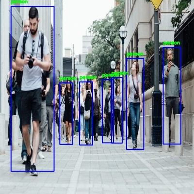
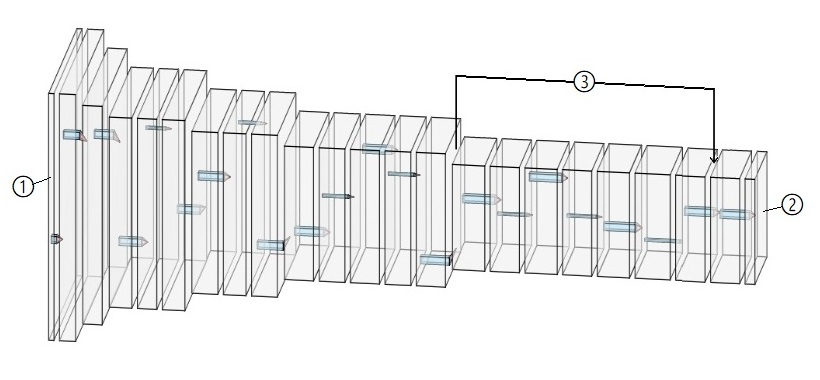

# driving-object-detector
DOD is a deep object detection algorithm implemented using Keras/Tensorflow, developed based on Joseph Redmon's 
Darknet-"You only look once V2" and optimized to perform detections specific to vehicle self driving applications.




The images above are taken randomly from the Google image search results for "car on road" and "pedestrians" and were
annotated with the 'dod_beta_6' version of the detector. The images are not found in training or validation data 
sets and offer an overview of detection performance on real world data.

#### Detector specifications:<br />

Input:<br/>
batches of images with shape (608 pixels, 608 pixels, 3 RGB channels)<br/>

Output:<br/>
batches of predictions consisting of a bounding box and a class for every relevant object in image<br/>
the hard maximum of predictions per image is 1,805‬ (all processed at once) but 
in practice we see a soft maximum of around 400 to 600 (sufficient for self driving applications)

Classes currently trained:<br/>
'person',<br />
 'bicycle', 'skateboard',<br />
 'car', 'truck', 'motorcycle', 'bus', 'train',<br />
 'traffic light', 'stop sign', 'parking meter',<br />
 'sports ball',<br />
 'animal'<br />
 
Model architecture diagram:
<br />
① - model input - (608, 608, 3)<br />
② - model output - (19, 19, 90) reshaped to (19, 19, 5, 4+1+13) - 4 box coordinates, 1 confidence, 13 classes  <br/>
③ - convolutional skip connection - (38, 38, 64) reshaped to (19, 19, 256)<br />

#### Credit where credit is due:

[Joseph Redmon](https://pjreddie.com/): approach to training a neural network for object detection - this project uses 
the feature extraction section of his model converted to Keras.
- [Original YOLO publication](https://arxiv.org/pdf/1506.02640.pdf) - main inspiration for this project
- [YOLO V3 - Latest publication in object detection](https://pjreddie.com/media/files/papers/YOLOv3.pdf) - not used here
but very cool

[Guillaume Ramé](https://github.com/guigzzz): developing the loss calculation approach compatible with Keras models. 
The conversion process from list predictions to y_train vectors for training is largely a product of his work.
- [Professional profile](https://uk.linkedin.com/in/guillaume-rame)
- [Keras-Yolo-v2 work](https://github.com/guigzzz/Keras-Yolo-v2)


## Usage

#### Stack versions:

Cuda CuDNN v10.0
Tensorflow 1.13.1 <br />
Keras 2.2.4 <br />
(Working on upgrading to tensorflow 2.0)

#### Create detector and load model:
```py
from detectors import dod_beta_6 as arch

detector = arch.DrivingObjectDetector()

detector.model = load_model('keras model location')
```
Creating the detector also builds the default untrained model. You can load in a trained model using 'load_model' from 
Keras.models or import specific sections of models using 'import_weights':

```py
detector = arch.DrivingObjectDetector()

detector.import_weights('model location', first_layer, last_layer)
```
#### Basic deployment:
You can quickly test how the loaded model deploys using the on_image_folder function:
```py
import deploy

deploy.on_image_folder(detector, input_path, output_path, batch_size, conf_thresh, max_supp_thresh)
```
input_path - location of folder containing .jpg images <br />
output_path - where the annotated images get saved <br />
batch_size - maximum batch size loaded (number of images does not need to be multiple)<br />

#### Advanced deployment
The model takes an image batch and outputs a vector sparsely populated by detections that exceed the
confidence threshold. This vector can be processed into a 'detections list'
that is human readable and CPU processing friendly.
```py
import numpy as np
import processing

image_batch = #get images in a batch, can be from folder or frames from video etc...
image_batch = np.asarray(image_batch) / 255. # color values between 0-1

pred_vectors = detector.model.predict(image_batch, batch_size=image_batch.shape[0])
pred_lists = processing.process_output_batch(pred_vectors, detector.anchors, conf_thresh, max_supp_thresh)
```
image_batch shape - (number_of_images, image_width, image_height, number_of_channels)<br />
pred_vector - has the shape of the last layer in the Keras model, ex: (?, 19, 19, 5, 18)<br />
pred_lists - contains a batch of lists with predicted bounding boxes and respective classes with
one detection formatted as [box_x, box_y, box_width, box_height, object_class], example:
```py
print(pred_lists[0])

[[231, 123, 421, 442, 0]
 [65, 153, 54, 65, 1]
 [12, 53, 345, 65, 8]
 [432, 344, 63, 234, 12]]
```

## Training

#### Data format and pre-processing

The data used in this project comes from the [COCO 2017 dataset](http://cocodataset.org/#home). It has been 
preprocessed based on relevancy for self driving applications creating super-clases where detailed detection is not 
of use, example: 'animal' (no use to distinguish zebras from giraffes)<br/>
The annotations have been formatted for ease of access:

```py
"000000252219.jpg": [[309, 247, 376, 527, 0, "person"], 
                    [9, 237, 124, 558, 0, "person"], 
                    [484, 243, 601, 549, 0, "person"], 
                    [320, 62, 378, 143, 8, "traffic light"]]
#see 'data_example' folder
```
#### Optimising the detector model
For optimisation you will need to create the data_flow objects for training and validation:
```py
import batchers

data_flow_train = batchers.LocalBatcher(data_path='training data location',
                                        batch_size,
                                        restart_after=None)

data_flow_test = batchers.LocalBatcher(data_path='validation data location',
                                       batch_size,
                                       restart_after=None)
```
The detector model needs to be compiled with the optimizer and the custom loss function:
```py
from keras.optimizers import SGD, Adam
import loss

detector.model.compile(optimizer=SGD(lr, momentum),
                       loss=loss.get_function(detector.anchors))
```
Now you can start the training session using the training script:
```py
import training

training.start_session(experiment_path='experiment location',
                       detector=detector,
                       data_flow_train=data_flow_train,
                       data_flow_test=data_flow_test,
                       epochs = #number of optimisation passes)
```
The script will initialize a local experiment and save the model states, training samples, test samples and metrics.
If an experiment already exists at the specified location, the script will load the experiment configuration and pick up 
where it left off. You can also skip the gradient pass and perform only evaluation using 'test_only = True'<br/>

See the 'Example_Notebook' file for a detailed view into how the training environment works.

## How the model learns:

Sampling during training allows us to view how the detection performance increases with 
the number of training epochs.<br/>
The following samples were taken with a confidence threshold of 0.05 and with non max suppression disabled. <br/>
<br/>
The first epoch prediction amounts to noise with a high number of erroneous detections:<br/>

<br/>
<br/>
At epoch 600 we see the number of false detections went down due to the 'no_obj_loss' term of the loss function.
If we set the 'noobject_conf_scale' factor to 0 this does not happen: <br/>

<br/>
<br/>
At epoch 2200 we see a small number of partially correct detections. Note that some objects were not detected
and the majority of bounding boxes and some classes are incorrect:<br/>

<br/>
<br/>
At epoch 46000 we see multiple detections per object (multiple cells have high confidence). This prediction can be 
processed with confidence thresholding and non max suppression to get a quality result: <br/>

<br/>
<br/>
With a higher confidence threshold and non max suppression applied predictions on validation data look like this, 
note that more optimisation is necessary for objects that have small 
bounding boxes (are far away in the image): <br/>

<br/>